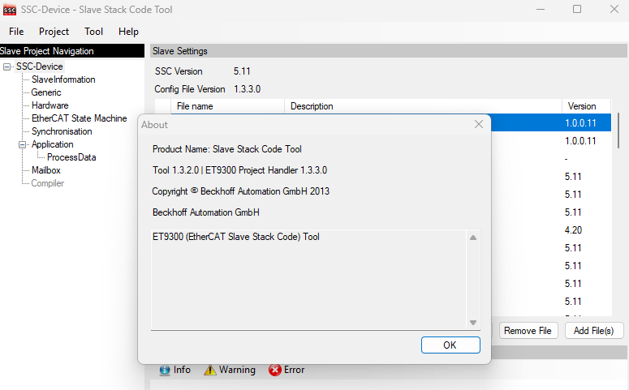
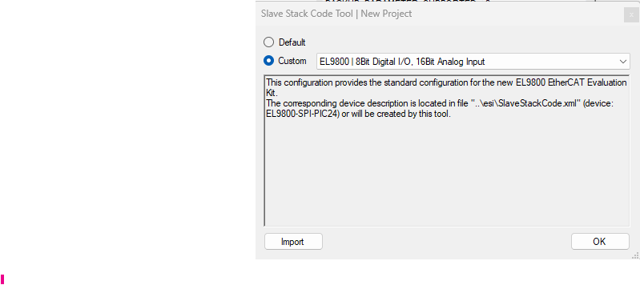
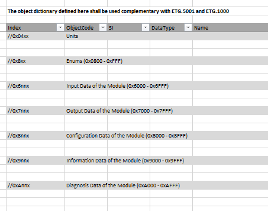
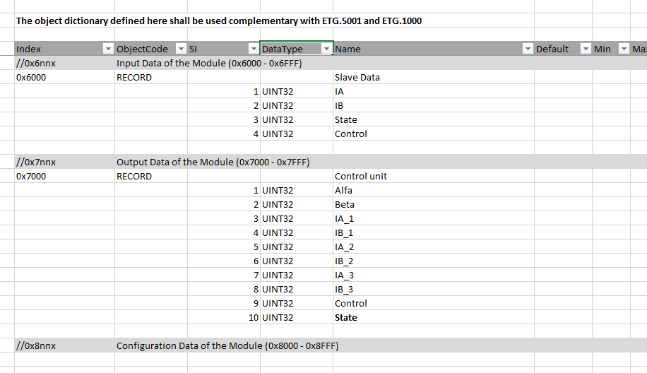
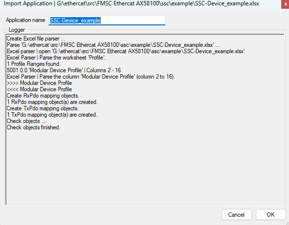
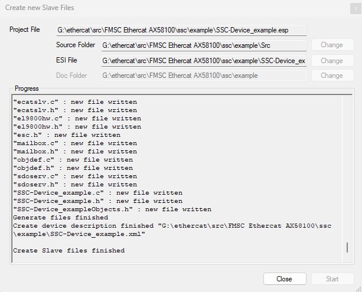
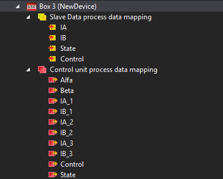

# Создание новой конфигурации ESI для EtherCat Slave устройства (ESC) 

1. Используем ПО SSC- кодегенератор стека для ведомого устройства EtherCAT.
 

2. Для создания нового проекта выбираем 
> File -> New



В качестве шаблонного проекта можно выбрать спецификацию модуля EL9800 или воспользоваться кнопкой импорт

3. Изменяем следующие параметры

|  Parameter   | Old value | New value| 
|----------|----------|----------|
|USE_DEFAULT_MAIN|1|0|
|CONTROLLER_16BIT|1|0|
|CONTROLLER_32BIT|0|1|

4. Формируем структуру данных



Формируем структуру данных, в поле индекс в графе //0х6nnn заполняем поля структуры, тип данных, символьное имя . Здесь будут данные доступные для чтения, обновляемые контроллером слэйва, т.е. для мастера модификатор RO. В поле индекс в графе //0х7nnn заполняем поля структуры для данных с модификатором доступа R\W относительно мастера




Сохраняем и закрываем файл эксель. ПО SSC парсит эксель файл, в случае успеха выдается диагностическое сообщение, где подтверждаем создание структуры данных


5. Генерируем код стека и ESI файл описания слэйва
> Project -> Create New Slave Files



6. Для проверки можно использовать ПО TwinCAT. Копируем ESI файл в папку C:\TwinCAT\3.1\Config\Io\EtherCAT. Создаем новый проект и добавляем устройство с нашим описанием. 




для корректной работы микросхемы AX58100LT необходимо обновить поле конфигурации EEPROM. Подробная расшифровка поля ConfigData в мануале на микросхему 
```
<Eeprom>
    <ByteSize>2048</ByteSize>
    <ConfigData>080000cc0a000000000000000000</ConfigData>
</Eeprom>
```

7. Обновляем конфигурацию EEPROM устройства (см. соотвествующий гайд)

8. Обновляем файлы исходников EtherCAT стека на микроконтроллере

удаляем файлы 
```
el9800hw.c
el9800hw.h
```

меняем в файле ecat_def.h
```
#define EL9800_HW  0
#define MCI_HW
```
9. Доступ к данным PDO 

Выходы

```
/**
\param      pData  pointer to output process data

\brief    This function will copies the outputs from the ESC memory to the local memory
            to the hardware
*////////////////////////////////////////////////////////////////////////////////////////
void APPL_OutputMapping(UINT16* pData)
{
#if _WIN32
   #pragma message ("Warning: Implement output (Master -> Slave) mapping")
#else
    #warning "Implement output (Master -> Slave) mapping"

    
#endif
}
```

Входы

```
/**
\param      pData  pointer to input process data

\brief      This function will copies the inputs from the local memory to the ESC memory
            to the hardware
*////////////////////////////////////////////////////////////////////////////////////////
void APPL_InputMapping(UINT16* pData)
{
#if _WIN32
   #pragma message ("Warning: Implement input (Slave -> Master) mapping")
#else
    #warning "Implement input (Slave -> Master) mapping"
#endif
}
```

Исправить в файле ecatdef.h 
```

/** 
OBJ_DWORD_ALIGN: Shall be set if the object structures are not Byte aligned and the Code is executed on an 32bit platform */
#ifndef OBJ_DWORD_ALIGN
#define OBJ_DWORD_ALIGN                           1
#endif

/** 
OBJ_WORD_ALIGN: Shall be set if the object structures are not Byte aligned and the Code is executed on an 16bit platform */
#ifndef OBJ_WORD_ALIGN
#define OBJ_WORD_ALIGN                            0
#endif

```


