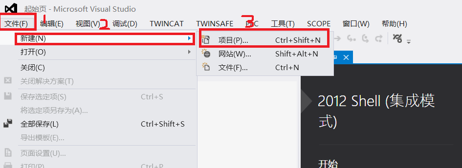
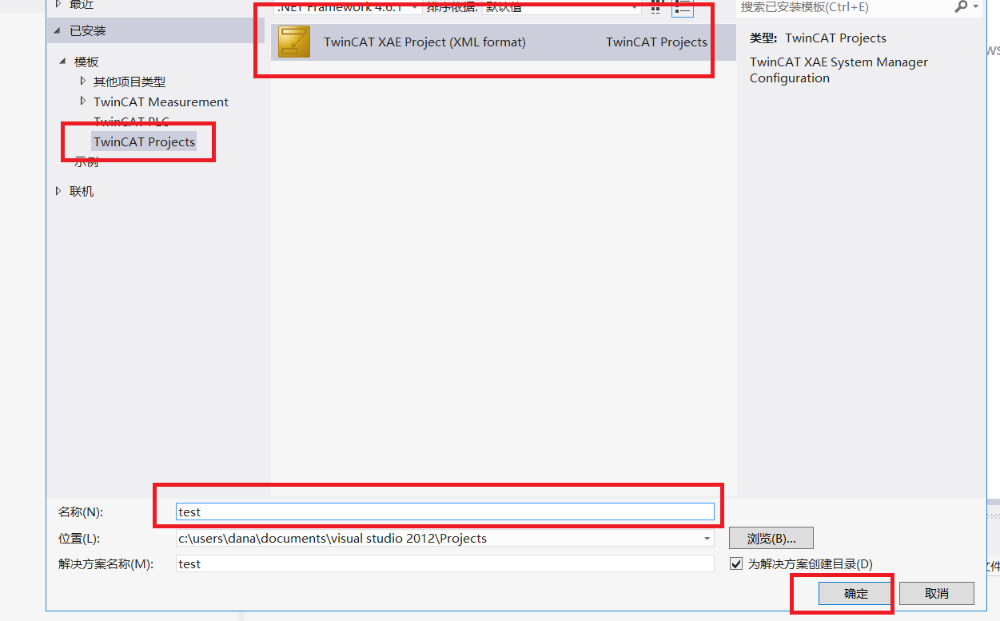
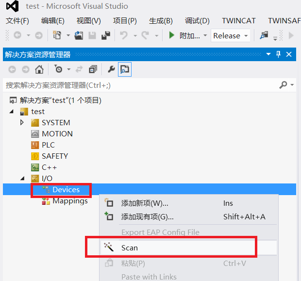
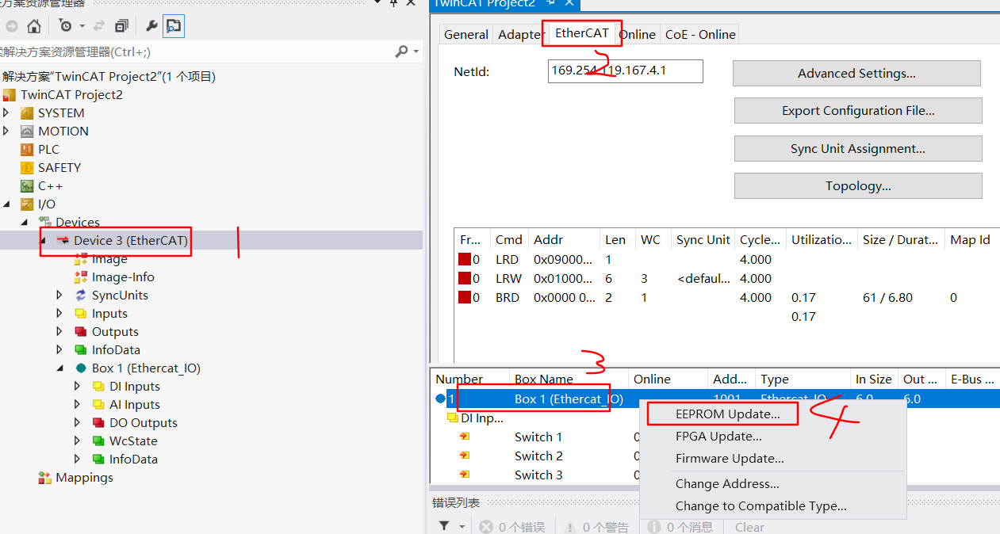
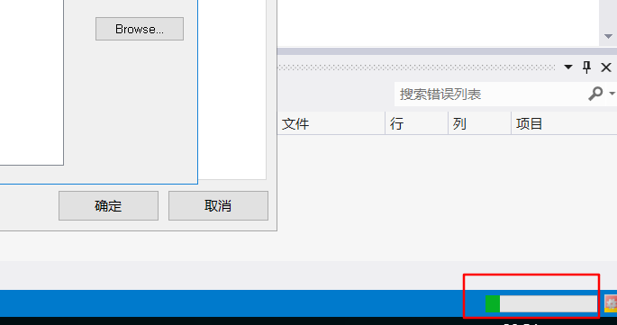

# Программирование  EEPROM EtherCAT Slave через ПО TwinCAT 3.1

1. Для прошивки необходим файл конфигурации ведомого устройтва (ESI) в формате xml. Файл может быть сгенерировать через приложение SSC (EtherCAT Slave Stack Code Tool).

2. Для того чтобы конфигурация отражалась в ПО TwinCAT ESI файл должен быть скопирован в папку:

> C:\TwinCAT\3.1\Config\Io\EtherCAT

3. Создаем новый проект TwinCAT 

4. Подключаем плату и запускаем сканировоание устройств через контекстное меню дерева проекта

5. Device(EtherCAT) EtherCAT -> Box1 -> EEPROM Update

6. В появившемся окне выбираем устройство которое соотвествует нашему ESI файлу. 

7. Ждем завершение процесса программирования

