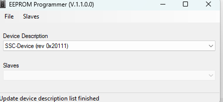
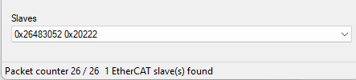

# Программирование EEPROM EtherCAT Slave через ПО SSC

1. Для прошивки необходим файл конфигурации ведомого устройства (ESI) в формате xml. 

2. ПО SSC представляет собой кодегенератор стека для ведомого устройства EtherCAT.
 

3. Функция программирования EEPROM доступна из меню
> Tools->EERPOM Programmer

4. Для загрузки ESI файла выбираем 
>File->Open

Название устройства отобразится в выпадающем списке "Device Description"

5. Для поиска EtherCAT устройства используем F5. 

В открывшемся списке выбираем Ethernet интерфейс к которому подлечено EtherCAT устройство. Если опознано то в окне "Slaves" отобразится идентификатор устройства. В случае с новым устройством будет значение 0xFFFFFFFF, если EEPROM устройства не функционирует будет выведено значение AD0 (требует уточнения!)

> 

6. Для старта процесса программирования жмем

> Slaves -> Program Selected

7. В строке состояния ждем подтверждения окончания процесса, далее обновляем список подключенных устройств, при успешном завершении идентификатор устройства сменится на новое значение. 