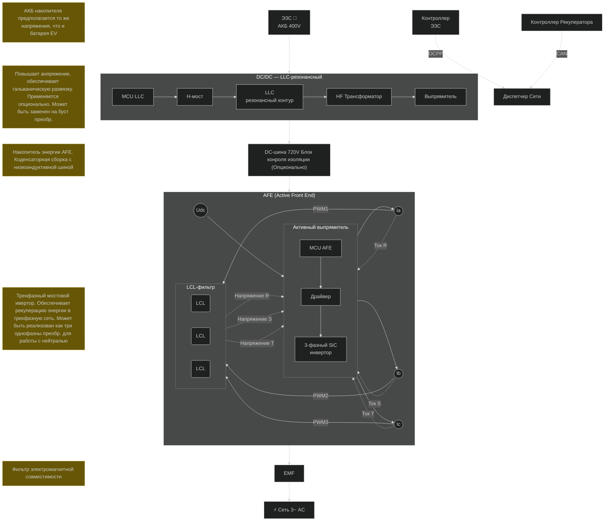

# Структурная схема Charger to Grid конвертора

```mermaid
flowchart TB

    %%{init: {"theme": "dark", "themeVariables": {"darkMode": true}}}%%
    %%{init: {"themeVariables": {"fontSize": "16px"}}}%%

    N1["АКБ накопителя <br/> предполагается то же напряжения, что и батарея EV"]
    N2["Повышает анпряжение, обеспечивает гальваническую развязку. Применяется опционально. Может быть заменен на буст преобр. "] 
    N3["Накопитель энергии AFE. Коденсаторная сборка с низкоиндуктивной шиной"]
    N4["Трехфазный мостовой ивертор. Обеспечивает рекуперацию энергии в трехфазную сеть. Может быть реализован как три однофазны преобр. для работы с нейтралью"]
    N5["Фильтр электромагнитной совместимости"]
    
    N1~~~N2~~~N3~~~N4~~~N5


    BAT[" ЭЗС 🔋 <br/> АКБ 400V"] --> LLC
      
    subgraph LLC["DC/DC — LLC-резонансный"]
        MCU_LLC["MCU LLC"]-->HB
        direction LR
        HB["H-мост"] --> LR["LLC<br/>резонансный контур"]
         --> TR["HF Трансформатор"]
        TR --> RECT["Выпрямитель"]
    end
   
    LLC --> DCBUS["DC-шина 720V Блок конроля изоляции (Опционально)"]

    
    
    DCBUS --> AFE

     
    subgraph AFE["AFE (Active Front End) "]
        %%{init: {"flowchart": {"minNodeWidth": 0, "minNodeHeight": 0}}}%%
        direction LR
        Udc(("Udc")) --> INV
        IA -->|"PWM1"| LCL
        IB -->|"PWM2"| LCL
        IC -->|"PWM3"| LCL
        
        LCL -.->|"Напряжение R"| INV
        IA -.-> |"Ток R"|INV --> IA(("Ia<br/>"))
        LCL -.->|"Напряжение S"| INV
        IB -.-> |"Ток S"|INV --> IB(("Ib<br/>"))
        LCL -.->|"Напряжение T"| INV
        IC -.-> |"Ток T"|INV --> IC(("Ic<br/>"))
    
    end

    subgraph INV["Активный выпрямитель"]
        direction TB
        MCU_INV["MCU AFE"] -->
        DR["Драйвер"] -->
        BR["3-фазный SiC<br/>инвертор"]
 
    end

    subgraph LCL["LCL-фильтр"]
        direction LR
        LF_R("LCL")   
        LF_S("LCL") 
        LF_T("LCL")
    end

   

    AFE --> EMF--> GRID["⚡ Сеть 3~ AC<br/>"]

    classDef note fill: #665605 ,stroke:#b7950b,stroke-dasharray: 3 3;
    class N1 note;
    class N2 note;
    class N3 note;
    class N4 note;
    class N5 note;


    MCU2["Диспетчер Сети"]
    MCU1["Контроллер <br/>  ЭЗС"]
    MCU3["Контроллер Рекуператора"]


    MCU1-->|"OCPP"|MCU2
    MCU3-->|"CAN "|MCU2
```

    